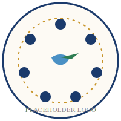

# Камбани за мир — уебсайт

Сайт на Фондация в обществена полза „Камбани за мир" и нейната първа програма —
националната инициатива за детско творчество и мир „Камбанен звън огласява
мира" (21 септември 2026 г.).

Сайтът следва комуникационния принцип на фондацията: първо се представя
**фондацията** (мисия, визия, стратегия), а след това **програмата**, като неин
практически израз. Виж [fondaciyata.html](fondaciyata.html) и
[za-iniciativata.html](za-iniciativata.html).

Чист HTML5 + CSS3 + Vanilla JavaScript. Без framework, без build стъпка —
просто отворете файловете в браузър или ги качете на хостинг.

## 1. Структура на файловете

```
kambanizamir/
├── index.html                    Начало
├── fondaciyata.html              За фондацията (мисия, визия, стратегия 2026–2036)
├── za-iniciativata.html          За инициативата (първата програма)
├── 21-septemvri.html             21 септември 2026 (централно събитие)
├── sedmitsa-za-mir.html          Седмица за мир 2026 (18–25 септември)
├── byaloto-platno.html           Бялото платно „Мирът е моят избор"
├── uchastie-chujbina.html        Участие от чужбина
├── manifesti.html                Манифести (фондация, инициатива, деца)
├── novini.html                   Новини
├── materiali.html                Материали за изтегляне
├── partnori.html                 Партньори и подкрепа
├── partniorski-paketi.html       Партньорски пакети
├── kontakti.html                 Контакти + основна регистрационна форма
├── css/                          main.css, components.css, layout.css, animations.css
├── js/                           main.js, animations.js, forms.js
├── assets/                       лога, favicon, манифести (PDF), материали (PDF)
└── README.md                     този файл
```

Header и footer са еднакви на всичките 13 страници — ако искате да промените
навигацията или контактна информация, направете промяната във всеки файл
(търсете `<header class="site-header">` и `<footer class="site-footer">`).

## 1.1 Как да добавите новина

В [novini.html](novini.html) новините са картички, преизползващи стила
`.download-card`. За да добавите нова новина, копирайте картичката, посочена
с HTML коментара „ШАБЛОН ЗА НОВИНА" в горната част на решетката, и я
поставете **най-отгоре** (най-новите новини вървят първи).

## 2. Как да настроите формите (Formspree)

Сайтът има 4 форми, всичките сочат към `https://formspree.io/f/REPLACE_WITH_ID`:

- **kontakti.html** — основната регистрационна форма
- **uchastie-chujbina.html** — форма за участие от чужбина
- **partnori.html** — форма за партньорство
- **byaloto-platno.html** — форма за заявка с бяло платно

Стъпки:

1. Отидете на [formspree.io](https://formspree.io) и създайте безплатен акаунт.
2. Натиснете „New Form", дайте име (напр. „Камбани за мир — Контакти").
3. Formspree ще ви даде адрес от вида `https://formspree.io/f/abc12345`.
4. Отворете съответния `.html` файл и заменете `REPLACE_WITH_ID` с вашия код
   (можете да направите по отделна форма за всяка страница, или една и съща
   за всички — както предпочитате).
5. Първото изпратено съобщение трябва да бъде потвърдено от имейла, който сте
   регистрирали в Formspree — след това формата работи автоматично.

Формите използват AJAX (виж `js/forms.js`) — потребителят не напуска страницата,
вижда съобщение за успех директно на сайта.

## 3. Как да добавите реалните лога

В момента логото в header/footer е текстов placeholder (🔔 + текст). За да
сложите истинското лого:

1. Качете вашите PNG/SVG файлове в `assets/` (вече има placeholder файлове
   `logo-kamb-za-mir.svg` и `logo-kamb-zvun.svg` — заменете съдържанието им
   или добавете нови файлове).
2. Във всеки `.html` файл намерете:
   ```html
   <div class="logo-placeholder">
     <span class="logo-bell">🔔</span>
     <div class="logo-text">...</div>
   </div>
   ```
3. Заменете с:
   ```html
   
   ```

## 4. Как да добавите PDF файлове

Всички линкове за изтегляне (манифести, брошура, указания, прес пакет) в момента
сочат към файлове в `assets/manifesti/` и `assets/materiali/`, които все още
не съществуват — кликването ще доведе до 404, докато не качите реалните файлове.

1. Качете вашите PDF файлове в:
   - `assets/manifesti/` — за `oficialen-manifest.pdf` и `manifest-deca.pdf`
   - `assets/materiali/` — за `broshura.pdf`, `ukazania-platno.pdf`,
     `pismo-podkrepa.pdf`, `pres-paket.pdf`, `koncepualna-programa.pdf`
   - `assets/materiali/logo-pack.zip` — архив с лога за партньори/медии
2. Уверете се, че имената на файловете съвпадат точно с `href` атрибутите
   в HTML (търсете `download` атрибута за всички тези линкове).

## 5. Как да добавите партньорски лога

В `partnori.html` и в секцията „Партньори" на `index.html` търсете:

```html
<div class="logo-placeholders">
  <div class="logo-ph"></div>
  ...
</div>
```

Заменете всеки `<div class="logo-ph"></div>` с:

```html
<div class="logo-ph"></div>
```

## 5.1 Илюстративни изображения (assets/img/)

В папка `assets/img/` има светли, ефирни илюстрации (камбани, гълъби, парк
„Камбаните", ръце с бяло платно), използвани в hero секциите и декоративните
ленти на сайта. Можете да ги замените с реални снимки по всяко време — просто
запазете същите имена на файловете (`hero-bell.jpg`, `doves-sky.jpg`,
`hands-canvas.jpg`, `children-doves.jpg`, `park-bells.jpg`, `two-bells.jpg`),
или обновете `src` атрибутите в съответните `.html` файлове.
Файлът `assets/og-image.jpg` се използва при споделяне в социалните мрежи.

## 6. Снимки на бели платна (галерия)

В `byaloto-platno.html` секцията „Галерия" има 6 placeholder кутии
(`.gallery-ph`). Заменете ги с `` тагове, когато получите реални снимки
от участници.

## 7. Хостинг — препоръки

Сайтът е статичен — работи на всеки хостинг без backend. Препоръчваме:

- **Netlify** (препоръчван, безплатен) — отидете на [netlify.com](https://netlify.com),
  плъзнете папката `kambanizamir/` в техния drag-and-drop drop zone, готово.
  Поддържа собствен домейн и автоматичен HTTPS.
- **GitHub Pages** — качете съдържанието в GitHub repo и активирайте Pages
  от Settings → Pages.
- **Традиционен хостинг (cPanel и т.н.)** — качете цялата папка през FTP
  в `public_html/` или съответната root директория.

Във всички случаи: уверете се, че `index.html` е в root директорията на
хостинг пространството, за да се зарежда автоматично на главния домейн.

## 8. Важни линкове

- Formspree (форми): https://formspree.io
- Netlify (хостинг): https://netlify.com
- Google Fonts (вече вградени): Playfair Display + Inter
- Font Awesome (вече вграден чрез CDN в `<head>` на всяка страница)

## 9. Технически детайли

- Countdown таймерът (на началната страница) брои реално време до
  21.09.2026, 12:00 ч. българско време — работи автоматично, няма нужда
  от настройка.
- Активната навигационна връзка (текущата страница в менюто) се оцветява
  автоматично от `js/main.js`.
- Reveal анимациите при scroll и камбанните звукови вълни са чист CSS +
  Intersection Observer — без зависимости.
- Сайтът поддържа `prefers-reduced-motion` — анимациите се изключват за
  потребители с такава системна настройка.

## 10. Контакт за техническа помощ

При въпроси по поддръжката на сайта се свържете с екипа, който е изградил
сайта, или с info@peacehub.bg за съдържателни въпроси по инициативата.
